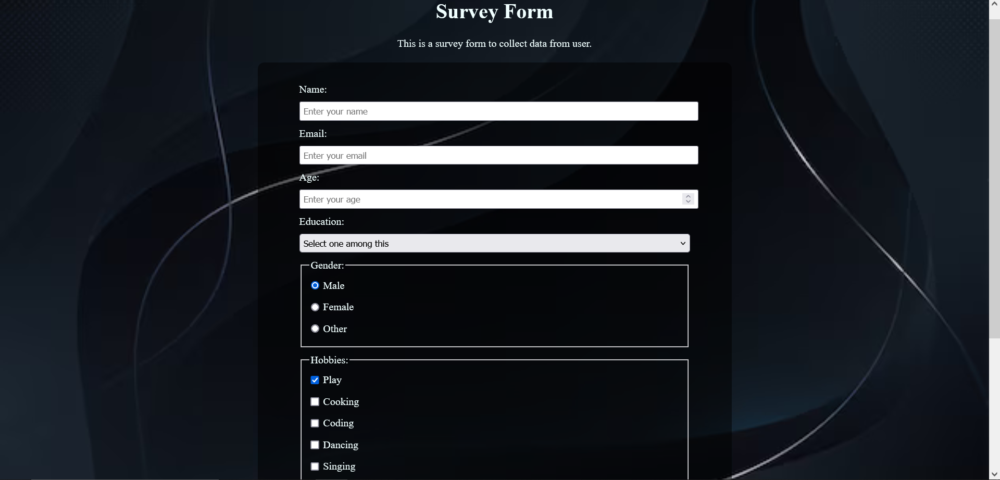
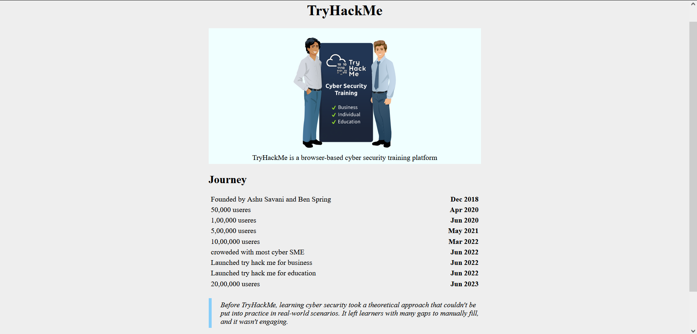
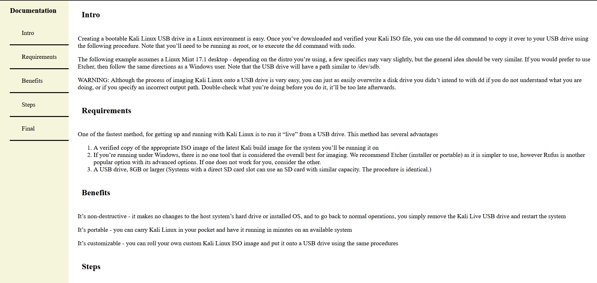

# Survey Form

This is a survey form created as part of the FreeCodeCamp certification task. The form collects user data including name, email, age, education, gender, hobbies, and additional comments.

## Project Structure
- `index.html` - Contains the HTML structure of the survey form.
- `style.css` - Contains the CSS styles for the survey form.
- `README.md` - This file, providing an overview of the project.

## Requirements Fulfilled
- A page title in an `h1` element with an id of `title`.
- A short explanation in a `p` element with an id of `description`.
- A form element with an id of `survey-form`.
- Inside the form element:
  - An input field for the name with an id of `name` and a type of `text`.
  - An input field for the email with an id of `email`.
  - An input field for age with an id of `number`. The input accepts only numbers and has validation for correct formatting.
  - Label elements for the name, email, and number input fields with ids: `id="name-label"`, `id="email-label"`, and `id="number-label"`.
  - Placeholder text for the name, email, and number input fields.
  - A select dropdown element with an id of `dropdown` and at least two options.
  - A group of at least two radio buttons for gender selection.
  - A series of checkboxes for selecting hobbies, each with a value attribute.
  - A textarea for additional comments.
  - A submit button with an id of `submit`.

## Usage
1. Open `index.html` in a web browser to view the form.
2. Fill out the form fields as required:
   - Enter your name, email, and age.
   - Select your education level from the dropdown.
   - Choose your gender using the radio buttons.
   - Select your hobbies using the checkboxes.
   - Enter any additional comments in the textarea.
3. Click the submit button to submit the form.

## Validation
- The email input field will show an HTML5 validation error if the email is not formatted correctly.
- The number input field will not accept non-numbers and will show an HTML5 validation error if the entered number is outside the specified range.

## Screenshots

## Second task

# TryHackMe Tribute Page
This project is a tribute page for TryHackMe, a browser-based cybersecurity training platform. The page is structured to meet specific requirements for a FreeCodeCamp project.

## Requirements
1. The main content is contained within an element with the id of `main`.
2. There is an element with the id of `title`, containing the text "TryHackMe".
3. A container element with the id of `img-div` holds an image and its caption.
4. Inside `img-div`, there is an image element with the id of `image`.
5. Inside `img-div`, there is an element with the id of `img-caption` that describes the image.
6. The main informational content is within an element with the id of `tribute-info`.
7. There is a link to an external site with the id of `tribute-link`, which opens in a new tab.
8. The image is responsive, using `max-width` and `height` properties to resize relative to its parent element without exceeding its original size.
9. The image is centered within its parent element.

## Project Structure
- `main` element: Contains all other elements on the page.
- `title` element: Contains the title of the page, "TryHackMe".
- `img-div` element: Contains the image and its caption.
  - `image` element: Displays the image related to TryHackMe.
  - `img-caption` element: Describes the image.
- `tribute-info` element: Contains the main content describing TryHackMe.
- `tribute-link` element: Provides a link to an external website for more information.

## Additional Information
- The `#image` element uses CSS properties to ensure it resizes responsively without exceeding its original dimensions.
- The `img` element is centered within the `img-div` element.

## Example
- The `main` element wraps all other content.
- The `title` element has the text "TryHackMe".
- The `img-div` element contains the `image` and `img-caption`.
- The `image` element has a source attribute pointing to the image file.
- The `img-caption` element contains text describing the image.
- The `tribute-info` element contains text providing information about TryHackMe.
- The `tribute-link` element is an anchor tag that opens an external site in a new tab.

Follow these guidelines to structure your HTML content and meet the project requirements.

## Screenshots

# Technical Documentation Page

This project is a technical documentation page created to fulfill the specified user stories and requirements. The page features a main content area and a navigation bar that helps users navigate through different sections of the documentation. The content and style are designed to be both functional and aesthetically pleasing.

## Features

- A main content area with the ID `main-doc` containing the documentation sections.
- Multiple `section` elements within the `main-doc` element, each with the class `main-section`.
- Each `main-section` element includes:
  - A header element describing the topic of the section.
  - An ID corresponding to the text of the header, with spaces replaced by underscores.
  - At least ten `p` elements in total across all sections.
  - At least five `code` elements in total across all sections.
  - At least five `li` items in total across all sections.
- A `nav` element with the ID `navbar` for navigation:
  - Contains a header element describing the topic of the documentation.
  - Includes `a` elements with the class `nav-link` for each `main-section`.
  - Each `nav-link` text corresponds to the header text within each section.
- Clicking on a `nav-link` navigates to the corresponding section of the `main-doc` element.
- The `navbar` is displayed on the left side of the screen on regular-sized devices (laptops, desktops) and is always visible.
- The page uses at least one media query for responsive design.

## User Stories

1. The `main-doc` element contains the main content of the page.
2. Within the `main-doc` element, there are several `section` elements with a class of `main-section`.
3. Each `main-section` has a header element that describes the section topic.
4. Each `main-section` has an ID that matches the header text with spaces replaced by underscores.
5. The `main-section` elements contain at least ten `p` elements in total.
6. The `main-section` elements contain at least five `code` elements in total.
7. The `main-section` elements contain at least five `li` items in total.
8. There is a `nav` element with the ID `navbar`.
9. The `navbar` contains a header element describing the documentation topic.
10. The `navbar` contains `a` elements with the class `nav-link` for each `main-section`.
11. The header in the `navbar` comes before any `nav-link` elements.
12. Each `nav-link` text corresponds to the header text within each section.
13. Clicking a `nav-link` navigates to the corresponding section.
14. On regular-sized devices, the `navbar` is displayed on the left side of the screen and is always visible.
15. The documentation uses at least one media query for responsive design.

## Acknowledgements

- Thanks to the freeCodeCamp curriculum for inspiring this project structure.
- Special thanks to all contributors and reviewers.

## Screenshots

